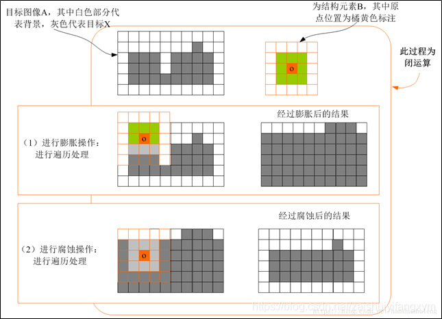
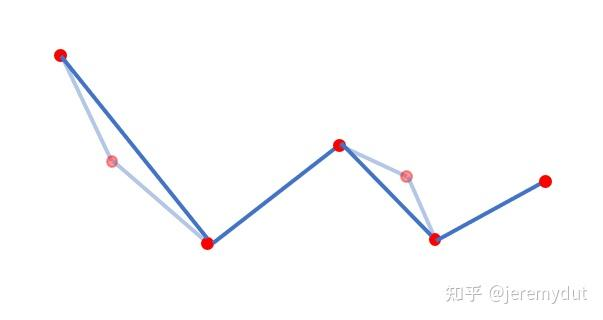
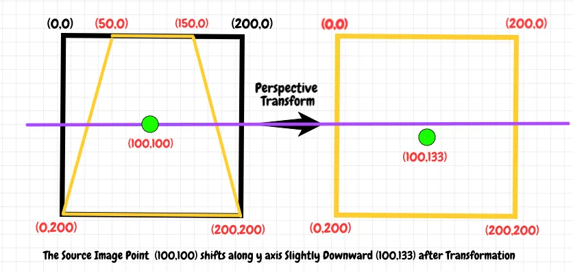

# 图像处理原理说明

## 1. 图像二值化处理

### 使用示例
```python
_, binary = cv2.threshold(img_gray, 0, 255, cv2.THRESH_BINARY_INV + cv2.THRESH_OTSU)
```

### 原理说明
**大津法（OTSU）自适应阈值**是一种自动确定最佳阈值的算法，特别适用于双峰直方图的图像。

**算法原理：**

1. 计算图像的灰度直方图
2. 遍历所有可能的阈值（0-255）
3. 对于每个阈值t，将像素分为两类：$C_1（≤t）$和$C_2（＞t）$
4. 计算类间方差$σ²(t) = ω₁(t)ω₂(t)[μ₁(t)-μ₂(t)]²$
5. 选择使类间方差最大的阈值作为最优阈值

**数学公式：**
- 类间方差：$\sigma^2(t) = \omega_1(t)\omega_2(t)[\mu_1(t)-\mu_2(t)]^2$
- 其中：
  - $\omega_1(t) = \sum_{i=0}^{t}p(i)$，$\omega_2(t) = \sum_{i=t+1}^{255}p(i)$
  - $\mu_1(t) = \frac{\sum_{i=0}^{t}i·p(i)}{\omega_1(t)}$，$\mu_2(t) = \frac{\sum_{i=t+1}^{255}i·p(i)}{\omega_2(t)}$

**代码作用：** 将灰度图像转换为二值图像，便于后续的轮廓检测。

**详细过程推导**：https://zhuanlan.zhihu.com/p/649435540

## 2. 形态学闭运算

### 函数位置

```python
kernel = cv2.getStructuringElement(cv2.MORPH_RECT, params['morph_kernel'])
morph_detect = cv2.morphologyEx(bin_detect, cv2.MORPH_CLOSE, kernel)
```

### 原理说明

**形态学闭运算**是先膨胀后腐蚀的组合操作，用于填充小孔洞和连接断裂区域。

#### 2.1 结构元素定义

```python
morph_kernel = (3, 3)  # 3×3矩形结构元素
```

**结构元素**：定义形态学操作的邻域形状和大小

- 矩形：全面的邻域覆盖
- 大小3×3：适中的操作强度

#### 2.2 膨胀操作（Dilation）

**数学定义**：
$$A \oplus B = \{z | (\hat{B})_z \cap A \neq \varnothing\}$$

其中：

- $A$是输入二值图像
- $B$是结构元素
- $\hat{B}$是$B$的反射（关于原点对称）
- $(\hat{B})_z$表示将$\hat{B}$平移$z$

**实际效果**：扩大白色区域，填充小孔洞和断裂

#### 2.3 腐蚀操作（Erosion）

**数学定义**：
$$A \ominus B = \{z | (B)_z \subseteq A\}$$

**实际效果**：缩小白色区域，恢复大致形状，但保留膨胀填充的效果

#### 2.4 闭运算组合

**数学表达式**：
$$A \bullet B = (A \oplus B) \ominus B$$

**作用**：

- 填充填涂点内部可能存在的空白
- 连接因噪声而断裂的填涂区域
- 平滑轮廓边界





## 3. 轮廓检测与筛选

### 函数位置

```python
cnts, _ = cv2.findContours(morph_detect, cv2.RETR_TREE, cv2.CHAIN_APPROX_SIMPLE)
```

### 原理说明

**轮廓检测**基于边界跟踪算法，提取二值图像中的连通区域边界。

#### 3.1 轮廓检索模式

`cv2.RETR_TREE`：检索所有轮廓并重建完整的层次结构

**层次关系**：

- 每个轮廓包含其父轮廓和子轮廓信息
- 形成树状结构描述包含关系

#### 3.2 轮廓近似方法

`cv2.CHAIN_APPROX_SIMPLE`：压缩水平、垂直和对角线段，仅保留端点

**近似原理**：

- 使用Ramer-Douglas-Peucker算法简化轮廓
- 保持形状特征的同时减少点数
- 对于矩形填涂点，只保留4个角点

**算法详细解释：**https://zhuanlan.zhihu.com/p/575618466



#### 3.3 边界跟踪算法（Suzuki85算法）

**算法步骤**：

1. 从左到右、从上到下扫描图像
2. 遇到前景像素（白色）时开始边界跟踪
3. 按顺时针或逆时针方向跟踪边界像素
4. 记录边界点的链码表示
5. 遇到已访问的边界点时停止

**边界跟踪算法Suzuki85具体原理解析**：https://zhuanlan.zhihu.com/p/397588540

#### 3.4 轮廓筛选条件

```python
# 基于几何特征的筛选
(min_area < area < max_area) and 
(0.2 < w_rect/h_rect < 5) and  # 宽高比合理
(min_height < h_rect < max_height) and 
(w_rect < max_width)
```

**筛选原理**：

- **面积筛选**：排除过大或过小的噪声点
- **宽高比**：填涂点应接近正方形（宽高比接近1）
- **尺寸范围**：符合实际填涂点的物理尺寸

## 4. 最小外接矩形

### 使用示例
```python
rect_ans = cv2.minAreaRect(largest_contour)
ans_box = cv2.boxPoints(rect_ans).astype("float32")
```

### 原理说明
**最小外接矩形算法**寻找能够完全包围轮廓且面积最小的旋转矩形。

**算法原理（基于旋转卡壳法）：**

1. 计算轮廓的凸包
2. 使用旋转卡壳法寻找凸包的最小面积外接矩形
3. 遍历凸包的所有边作为矩形的基准边
4. 对于每条边，计算：
   - 与该边平行的对跖点（最远点）
   - 与该边垂直的最远点
5. 记录面积最小的矩形

**数学公式：**
- 矩形面积：$Area = width \times height$
- 旋转角度：$\theta = \arctan(\frac{y_2-y_1}{x_2-x_1})$
- 矩形中心：$center = \frac{1}{4}\sum_{i=1}^{4} vertex_i$

**代码作用：** 获取答题区域和学号区域的精确边界框，用于透视变换。

**旋转卡壳法详细讲解：**https://blog.csdn.net/hanchengxi/article/details/8639476

## 5. 透视变换

### 使用示例
```python
M = cv2.getPerspectiveTransform(rect, dst)
warped = cv2.warpPerspective(img, M, (maxWidth, maxHeight))
```

### 原理说明
**透视变换**将图像从任意视角投影到正视图，消除透视畸变。

**数学原理（单应性矩阵）：**
透视变换使用3×3的单应性矩阵进行坐标映射：

$$\begin{bmatrix}
x' \\ y' \\ w'
\end{bmatrix} = 
\begin{bmatrix}
h_{11} & h_{12} & h_{13} \\
h_{21} & h_{22} & h_{23} \\
h_{31} & h_{32} & h_{33}
\end{bmatrix}
\begin{bmatrix}
x \\ y \\ 1
\end{bmatrix}$$

归一化后的坐标：$x'' = \frac{x'}{w'}$，$y'' = \frac{y'}{w'}$

**求解单应性矩阵：**
给定4组对应点，通过解线性方程组求H矩阵：
- 每对点提供2个方程：$x' = \frac{h_{11}x + h_{12}y + h_{13}}{h_{31}x + h_{32}y + h_{33}}$
- 共8个未知数，需要至少4对点

**重映射过程：**
1. 对目标图像的每个像素(x,y)
2. 计算在原图像中的对应位置：$[x', y', w']^T = H^{-1}[x, y, 1]^T$
3. 通过双线性插值获取像素值

**代码作用：** 将倾斜的答题卡区域校正为规整的正方形视图，便于后续的选项识别。



## 6. CLAHE对比度限制自适应直方图均衡化

### 使用示例
```python
clahe = cv2.createCLAHE(clipLimit=params['clahe_clip'], tileGridSize=params['clahe_grid'])
gray_enhanced = clahe.apply(gray)
```

### 原理说明
**CLAHE**是对传统直方图均衡化的改进，解决全局均衡化导致的过度增强问题。

**算法步骤**：

#### 6.1 图像分块
```python
tileGridSize=(8, 8)  # 将图像分为8×8的小块
```

**分块处理**：
- 将图像划分为多个不重叠的瓦片(tile)
- 对每个瓦片独立进行直方图均衡化
- 避免全局处理导致局部过度增强

#### 6.2 对比度限制
```python
clipLimit=3.0  # 限制对比度增强程度
```

**对比度裁剪**：
- 计算每个瓦片的直方图$H(i)$
- 设置裁剪限值：$clipLimit = \frac{N}{256} \times clipLimit_{param}$
  - 其中$N$是瓦片中的像素数
- 裁剪超过限值的直方图柱，将超出的像素数均匀分配到所有柱

**裁剪公式**：
$$H_{clip}(i) = 
\begin{cases} 
clipLimit & \text{if } H(i) > clipLimit \\
H(i) & \text{otherwise}
\end{cases}$$

#### 6.3 直方图均衡化
**均衡化变换函数**：
$$s = T(r) = (L-1) \sum_{j=0}^{r} p_r(j)$$

其中：
- $L$是灰度级数（通常256）
- $p_r(j) = \frac{n_j}{N}$是灰度级j的概率
- $n_j$是灰度级j的像素数
- $N$是总像素数

#### 6.4 双线性插值拼接
**瓦片边界处理**：
- 对每个瓦片应用变换函数后，使用双线性插值平滑瓦片边界
- 避免块状伪影

**作用**：增强填涂区域与背景的对比度，消除光照不均影响。

## 7. 自适应阈值二值化

### 使用示例
```python
bin_detect = cv2.adaptiveThreshold(gray_enhanced, 255, 
                                   cv2.ADAPTIVE_THRESH_GAUSSIAN_C, 
                                   cv2.THRESH_BINARY_INV, 
                                   params['adaptive_block'], 
                                   params['adaptive_c'])
```

### 原理说明
**自适应阈值**根据像素的局部邻域特性计算阈值，适应光照变化。

#### 7.1 高斯加权局部阈值
**算法选择**：`ADAPTIVE_THRESH_GAUSSIAN_C`

**阈值计算原理**：
对于每个像素$(x,y)$，计算其邻域内的加权平均值作为阈值：

$$T(x,y) = \mu(x,y) + C$$

其中：
- $\mu(x,y)$是$(x,y)$邻域的加权平均值
- $C$是常数偏移量（params['adaptive_c']）

#### 7.2 高斯权重计算
**邻域大小**：`adaptive_block=31`（31×31像素的邻域）

**高斯权重分布**：
$$G(x,y) = \frac{1}{2\pi\sigma^2}e^{-\frac{x^2+y^2}{2\sigma^2}}$$

其中$\sigma$根据邻域大小自动计算。

#### 7.3 二值化处理
**变换公式**（THRESH_BINARY_INV模式）：
$$dst(x,y) = 
\begin{cases} 
255 & \text{if } src(x,y) < T(x,y) \\
0 & \text{otherwise}
\end{cases}$$

**作用**：将填涂点（暗色）转为白色，背景转为黑色，便于轮廓检测。

## 8. 连通域

### 使用示例

```
num_labels, labels, stats, centroids = cv2.connectedComponentsWithStats(closed, connectivity=8)
```

**统计信息结构**：

num_labels: 返回值是连通区域的数量.

labels : labels是一个与closed一样大小的矩形，其中每一个连通区域会有一个唯一标识，标识从0开始。

centroids:返回的是连通区域的质心。

对于每个标签i（i≥1，0为背景），stats数组包含：

- `CC_STAT_LEFT`: 区域边界框左边界$x_{min}$
- `CC_STAT_TOP`: 区域边界框上边界$y_{min}$
- `CC_STAT_WIDTH`: 区域宽度$w=x_{max}−x_{min}+1$
- `CC_STAT_HEIGHT`: 区域高度$h=y_{max}−y_{min}+1$
- `CC_STAT_AREA`: 区域像素数A

### 原理说明

**连通域统计**在8连通标记的基础上，提供每个连通区域的详细几何信息。

**连通域**（Connected Component）是指图像中由相同像素值（通常是前景像素）组成的连通区域。在二值图像中，连通域分析就是找出所有相互连接的前景像素集合。

### 算法概述
OpenCV使用的是一种**两遍扫描算法**（Two-Pass Algorithm），这是连通域标记的标准高效算法。

### 第一遍扫描：初步标记

#### 扫描过程
从左到右、从上到下扫描图像，为每个前景像素分配临时标签：

```python
# 伪代码表示第一遍扫描
for y in range(height):
    for x in range(width):
        if image[y][x] == 前景:
            # 检查邻域像素
            检查左邻域和上邻域像素的标签
            if 左邻域和上邻域都是背景:
                分配新标签
            elif 只有一个邻域是前景:
                继承该邻域的标签
            else:  # 两个邻域都是前景但标签不同
                继承其中一个标签，并记录等价关系
```

#### 邻域检查（8连通）
对于当前像素P(x,y)，检查以下邻域：
- **左邻域**：P(x-1,y)
- **上邻域**：P(x,y-1) 
- **左上邻域**：P(x-1,y-1)
- **右上邻域**：P(x+1,y-1)

#### 等价关系处理
当发现两个邻域属于不同标签但实际连通时，建立等价关系表：
```
标签A ≡ 标签B ≡ 标签C
```

### 第二遍扫描：标签统一

#### 等价关系解析
根据第一遍建立的等价关系，将等价的标签统一为最小标签：

```python
# 伪代码表示第二遍扫描
for 每个像素:
    if 像素是前景:
        查找该标签的最终等价标签
        将像素标签更新为最终标签
```

#### 并查集数据结构
算法使用**并查集**（Union-Find）数据结构高效管理等价关系：
- **Find操作**：查找元素的根标签
- **Union操作**：合并两个等价集合

### 统计信息计算

在标记完成后，算法计算每个连通域的统计信息：

```python
# 统计信息计算伪代码
for y in range(height):
    for x in range(width):
        label = labels[y][x]
        if label != 背景:
            # 更新该标签的统计信息
            stats[label].面积 += 1
            stats[label].最小x = min(stats[label].最小x, x)
            stats[label].最大x = max(stats[label].最大x, x)
            # 同理更新y坐标
            # 累加x,y坐标用于质心计算
```

#### 质心计算原理
质心（重心）计算公式：
$$cx = \frac{\sum_{i=1}^{n} x_i}{n}, \quad cy = \frac{\sum_{i=1}^{n} y_i}{n}$$

其中：
- $n$是连通域的像素总数
- $x_i, y_i$是每个前景像素的坐标

## 8连通与4连通的数学定义

### 4连通定义
像素P的4邻域：
$$N_4(P) = \{(x-1,y), (x+1,y), (x,y-1), (x,y+1)\}$$

### 8连通定义  
像素P的8邻域：
$$N_8(P) = N_4(P) \cup \{(x-1,y-1), (x-1,y+1), (x+1,y-1), (x+1,y+1)\}$$

### 连通性判断
两个前景像素连通的条件：存在一条路径连接它们，路径上的每个像素都是前景且相邻像素满足连通关系。

## 算法复杂度分析

### 时间复杂度
- **第一遍扫描**：O(n) - n为像素总数
- **第二遍扫描**：O(n)
- **统计信息计算**：O(n)
- **总体复杂度**：O(n) - 线性复杂度，效率很高

### 空间复杂度
- **标签矩阵**：O(n) - 存储每个像素的标签
- **等价关系表**：O(k) - k为临时标签数
- **统计信息数组**：O(m) - m为最终连通域数量

